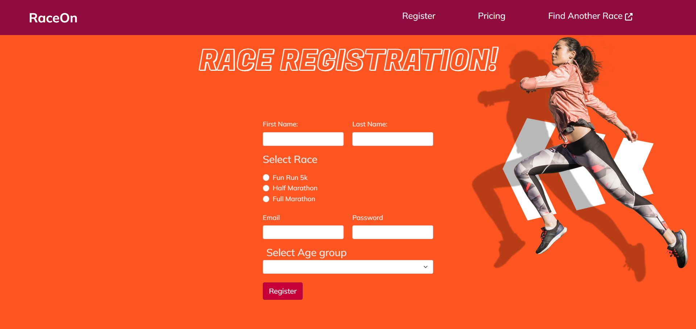

# Race Registration Sign-up Page
> Deployed with GitHub Pages 🔗https://cyphernyx.github.io/race-registration-form/

### Description

This repository contains a simple Marathon Registration Form using HTML, CSS and Bootstrap to create a landing page with a styled form ready to allow users to sign up for a marathon race.

## Table of Contents

- [Screenshot](#screenshot)
- [Technologies](#technologies)
- [Features](#features)
- [Usage](#usage)
- [Contributing](#contributing)
- [License](#license)

## Screenshot

You can check out the live demo of the Marathon Registration Form [here](https://cyphernyx.github.io/race-registration-form/).



## Technologies


## Features

- User-friendly sign-up form.
- Stylish and responsive design.
- Easy to integrate with your event website.

## Getting Started

Follow these instructions to get a copy of the project up and running on your local machine.

### Prerequisites

You need a web browser to view the HTML landing page. No additional software or tools are required.

### Installation

1. Clone this repository to your local machine using the following command:

   ```shell
   git clone https://github.com/CypherNyx/race-registration-form.git

2. Navigate to the project directory:

     ```shell
    cd race-registration-form

3. Open the index.html file in your web browser to view the landing page.

## Usage

1. Open the `index.html` file in your web browser.
2. Fill out the sign-up form with your details.
3. Click the "Submit" button to register for the marathon race.

Thank you for checking out the Race Registration Sign-up Page.

## Contributing
Pull requests are welcome. Please open an issue first to discuss any proposed changes or additions.
<br>

## License
[](https://opensource.org/licenses/MIT)
  
  https://opensource.org/licenses/MIT <br> 
  This project is open source and available under the MIT License.

<br>

  ## Questions
  GitHub [CypherNyx](https://github.com/CypherNyx)<br>
  Email: dguido.dev@gmail.com